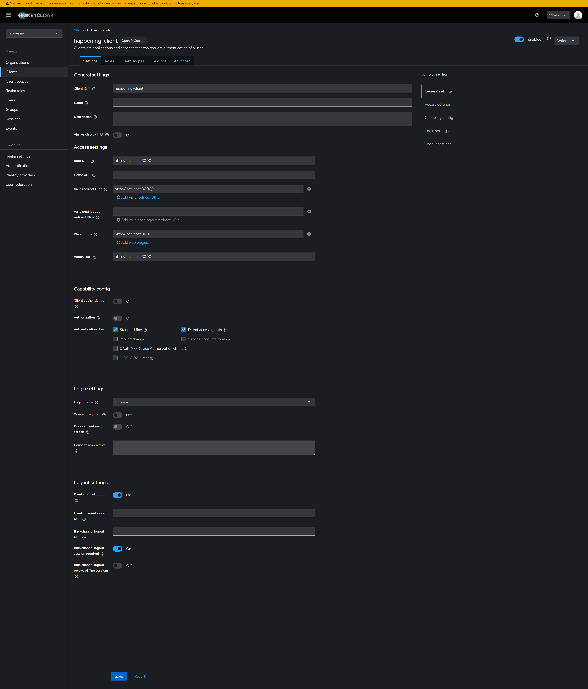
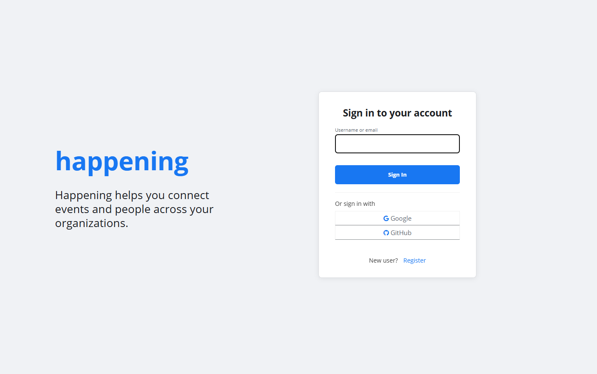
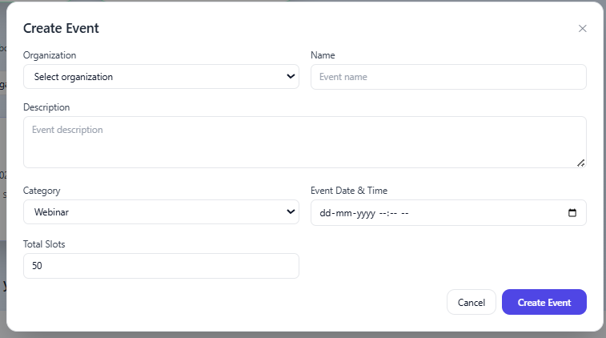
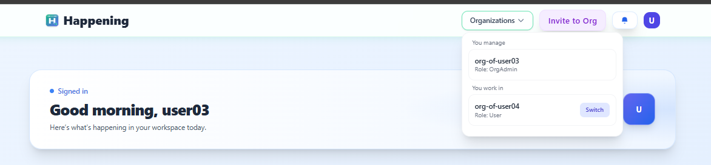
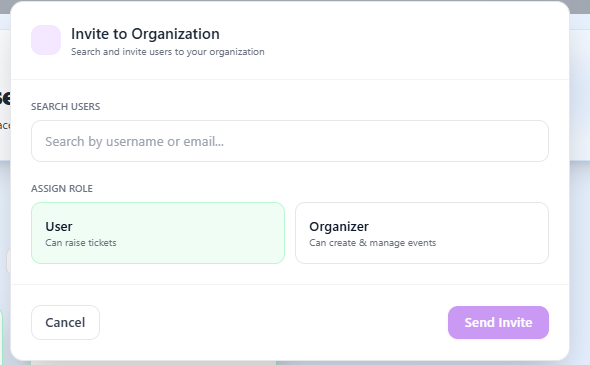
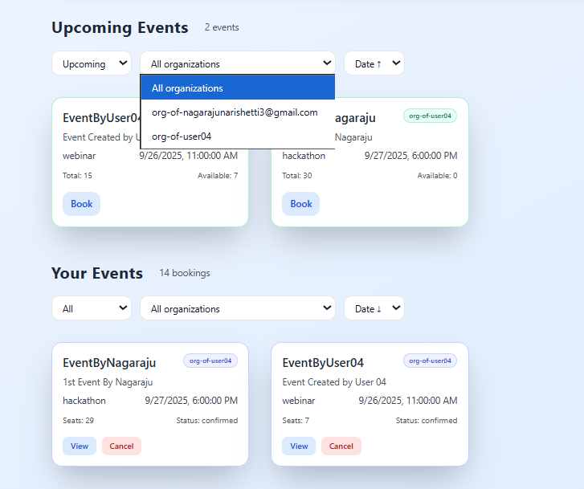
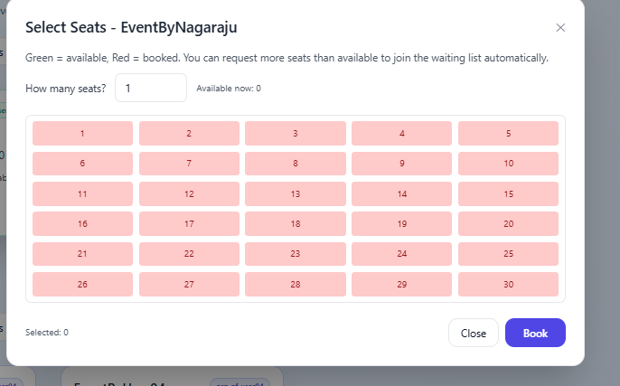
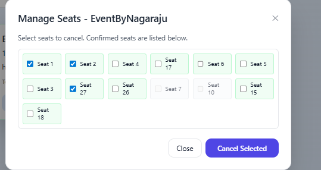
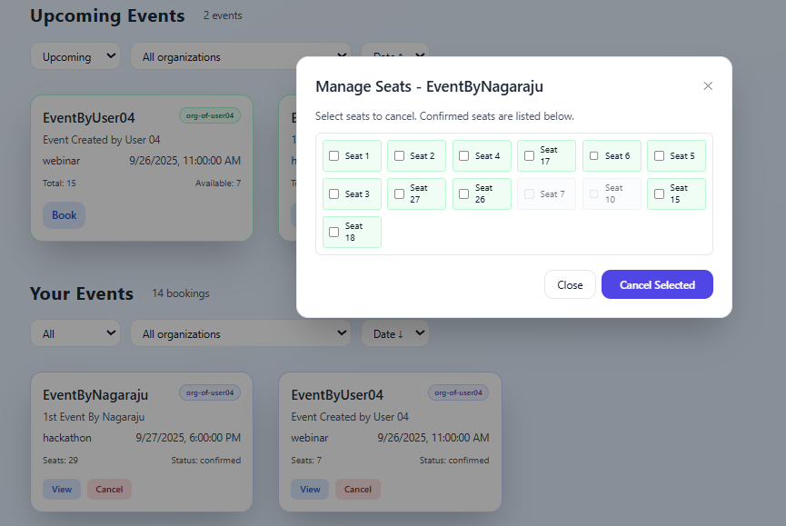
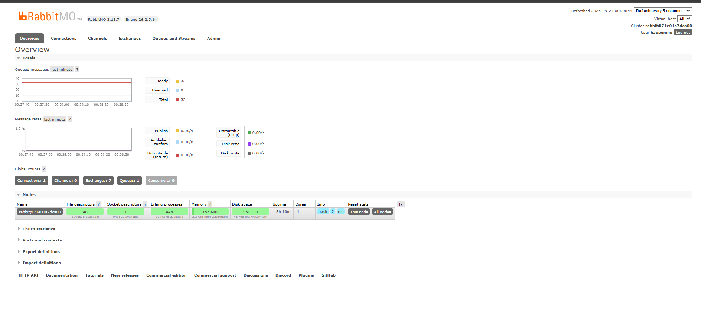

<p align="center">
  
</p>

# Happening – Multi‑Tenant Event Booking Platform

Happening lets organizations create and manage events while users book seats with real‑time availability and waitlist promotion.

Key links
- Architecture: [ABOUT_PROJECT/Architecture.md](ABOUT_PROJECT/Architecture.md)
- Tech stack: [ABOUT_PROJECT/TechStack.md](ABOUT_PROJECT/TechStack.md)
- Frontend: [ABOUT_PROJECT/Frontend.md](ABOUT_PROJECT/Frontend.md)
- Backend: [ABOUT_PROJECT/Backend.md](ABOUT_PROJECT/Backend.md)
- Infrastructure: [ABOUT_PROJECT/Infrastructure.md](ABOUT_PROJECT/Infrastructure.md)
- Operations: [ABOUT_PROJECT/Operations.md](ABOUT_PROJECT/Operations.md)
- Full review (A→Z): [review.md](review.md)
- Database schema: [server/sql/schema.sql](server/sql/schema.sql)

Repository structure
```
happening/
  client/            # Next.js app (UI)
  server/            # Express API, routes, workers
  docker/            # Local infra (Postgres, Redis, RabbitMQ, Keycloak)
  ABOUT_PROJECT/     # Architecture and technology docs
  README.md
```

Getting started
1) Start infra (dev):
```bash
cd docker
docker compose up -d
```
2) Backend:
```bash
cd ../server
npm install
npm run dev
```
3) Frontend:
```bash
cd ../client
npm install
npm run dev
```

Default ports
- Client: http://localhost:3000
- API: http://localhost:5000
- RabbitMQ mgmt: http://localhost:15672 (happening/happening)
- Keycloak: http://localhost:8080
- Postgres: 5432, Redis: 6379


Features
- Multi‑tenant organizations with roles: orgAdmin, organizer, user
- Event CRUD with categories and time; per‑seat selection and allocation
- Concurrency‑safe bookings using Redis atomic counters
- Automatic waitlist with promotion on cancellations
- Asynchronous notifications via RabbitMQ worker
- Keycloak authentication; role‑aware UI and API

Database schema (summary)
- organizations, users, organization_users(role)
- events(id, org_id, total_slots, available_slots, status, ...)
- bookings(event_id, user_id, seats, status, waiting_number, ...)
- booking_seats(event_id, booking_id, user_id, seat_no, status)
- booking_history(booking_id, action, details)
- notifications(user_id, event_id, type, message, status)

Redis keys
- event:{eventId}:slots → remaining capacity (integer). DECRBY on booking, INCRBY on cancel.
- event:{eventId}:waitlist → list of userIds. RPUSH on overflow, LPOP on promotion.

RabbitMQ
- Queue: notifications (durable)
- Producers: API on booking confirmed/waitlisted/promoted
- Consumer: server/workers/notificationsWorker.js

API quick reference
- Events: POST /events, GET /events, GET /events/:id, GET /events/:id/seats, PUT /events/:id, DELETE /events/:id
- Bookings: POST /bookings, GET /bookings/user/:userId, POST /bookings/:id/cancel, POST /bookings/:id/cancel-seats
- Orgs/Users/Invites: standard CRUD under /organizations, /users, /org-invites

Demo flow
1) Create an event (organizer role) with total slots
2) Book seats via seat selection modal in the dashboard
3) Over‑book to see waitlist behavior
4) Cancel a booking or seats to trigger promotion
5) Check RabbitMQ UI for notification activity

Troubleshooting
- API health: GET / (root) and GET /db-test
- Redis: check counters and lists (docker exec into redis and use redis‑cli)
- RabbitMQ: http://localhost:15672 (queue "notifications")


<!-- Client overview -->



Small overview of the Next.js client home/dashboard with organization switcher, sections for Upcoming Events and Your Events.

<!-- Server overview -->


High‑level look at the Express API and workers; routes handle events, bookings, organizations, and a background notifications worker.

<!-- Login + Keycloak theme -->



Custom Keycloak theme branding with Google and GitHub social login buttons styled to brand colors.

<!-- Create/host events (organizers) -->



Organizers create events specifying category, date/time, description and capacity. UI provides clear stats per event.

<!-- Switch organization feature -->



Multi‑tenant navigation: quickly switch context to another organization’s workspace while keeping permissions scoped.

<!-- Invitations -->



Invite users to organizations as viewer/user or organizer; role determines capabilities in the workspace.

<!-- Filters -->



Powerful filters for Upcoming/Your Events: by status (upcoming/completed), organization, and date sort.

<!-- Seat selection + booking -->


Per‑seat booking modal with live availability grid; pick exact seats or request a quantity.

<!-- Waitlist behavior -->



If demand exceeds supply, bookings join a waitlist. As seats free up, promotions happen first‑come‑first‑served and seat numbers are assigned.

<!-- Manage / cancel seats -->



Users can cancel specific seat numbers from their booking; availability updates instantly.



Grouped view of your bookings, with tools to view seat allocations and cancel per‑booking or per‑seat.

<!-- Redis + RabbitMQ architecture note -->



Concurrency‑safe counters in Redis guarantee consistent availability. RabbitMQ drives notification events (confirmations, waitlist promotions).
