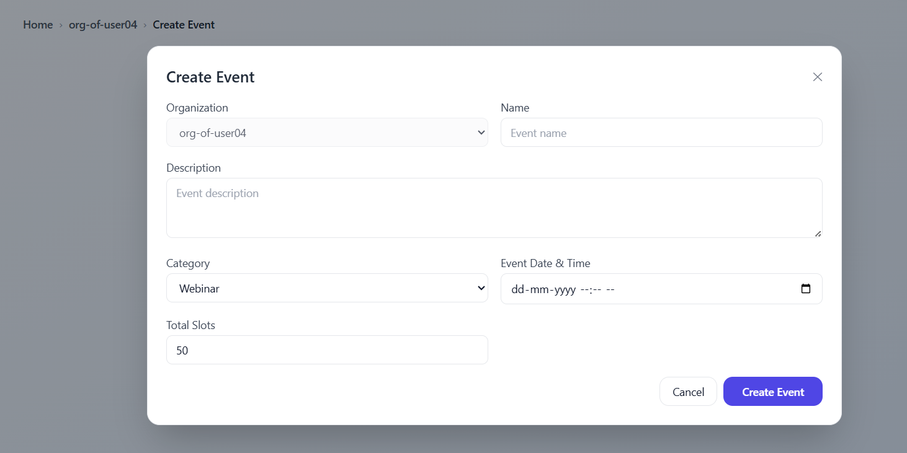
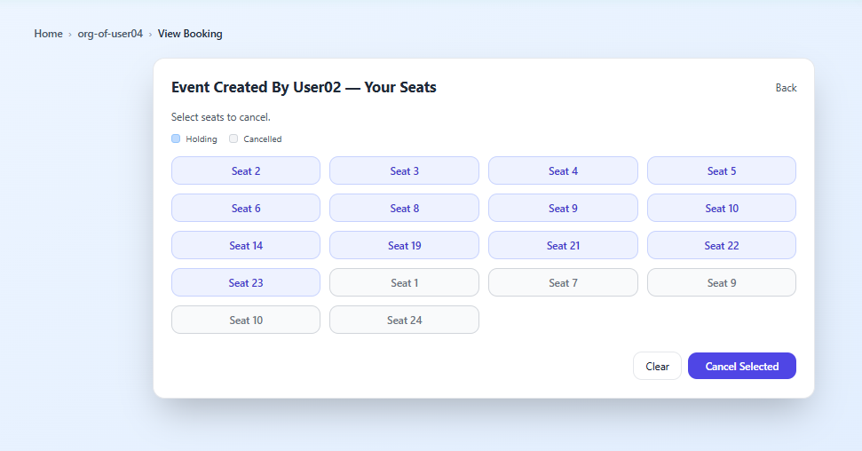
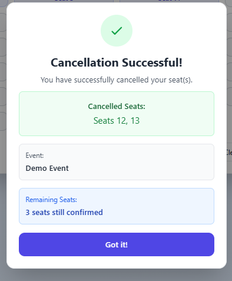

## Happening — Multi‑Tenant Real‑Time Event Booking Platform

This repository contains Happening, a multi‑tenant event booking platform (similar to BookMyShow/Eventbrite) featuring real‑time seat selection, coordinated waitlist promotion, notifications, and enterprise‑grade authentication.

- **Architecture**: see `ABOUT_PROJECT/Architecture.md`
- **Tech Stack & Rationale**: see `ABOUT_PROJECT/TechStack.md`
- **How It Works (end‑to‑end flows)**: see `ABOUT_PROJECT/HowItWorks.md`
- **Security & Authentication**: see `ABOUT_PROJECT/SecurityAuth.md`
- **Design Decisions & Trade‑offs**: see `ABOUT_PROJECT/Decisions.md`
- **Setup & Deployment**: see `ABOUT_PROJECT/SetupDeploy.md`

### Key Capabilities

- Multi‑tenant organizations, roles: orgAdmin, Organizer, User
- Real‑time seat selection with live presence/status using WebSockets
- FCFS waitlist with automatic promotion on cancellations
- Notifications via RabbitMQ workers (email/SMS/push ready)
- Source of truth in PostgreSQL with audit history
- Keycloak authentication including social logins

### Repository Overview (high‑level)

- `client/`: Next.js app, Keycloak integration, seat selection UI
- `server/`: Node.js backend (Express/Nest‑style structure), routes for bookings, events, organizations, notifications
- `server/sql/`: schemas and improvements
- `docker/`: local compose + Keycloak theme
- `ABOUT_PROJECT/`: documentation and images

### System Screens and Explanations

Each image is centered with a subtle border. A short explanation appears below each image.

1) Customized login page (Keycloak) with social logins

  

Description: Users authenticate via Keycloak; Google/GitHub SSO supported. Upon first login, an organization can be created for the user.

Additional Keycloak client configuration references:

  

  

2) RabbitMQ Dashboard (notifications pipeline)

  

Description: RabbitMQ management UI showing node health, queues, exchanges, connections, and message rates used by the notifications worker.

3) First page after login (home/dashboard)

  

Description: Landing experience showing upcoming events, organization context, and quick actions.

4) Home pages (marketing/summary sections)

  

Description: Marketing/overview page with platform value proposition.

  

Description: Additional highlights about features and user journeys.

5) Create event section (Organizer workflow)

  

Description: Organizers can define name, description, category, date/time, and total slots.

6) Organizer dashboard

  

Description: View and manage events, see statuses, and open seat management modals.

7) Organization switching

  

Description: Users belonging to multiple orgs can switch context; role‑based access applies per org.

7a) Invite users to organization and assign roles

  

Description: Search users by username/email and assign role as `User` (book tickets) or `Organizer` (create & manage events); sends invite.

8) Manage seats (Organizer)

  

Description: Organizer tools for seat map configuration and maintenance.

9) Book desired seats by selecting seat number (User)

  

Description: Real‑time seat map allows selecting exact seats. Reservation logic is coordinated via Redis and confirmed in PostgreSQL.

10) When a user selects seats, others see status instantly

  

Description: WebSocket updates broadcast seat holds/selections to all connected users to avoid collision.

11) Seat freezing with auto-deselection to prevent spam holding

  

Description: When users select seats, they become frozen (orange, pulsing) for others. Selected seats automatically deselect after 5 seconds if not booked, preventing spam holding while ensuring fair access.

12) When a user books, seats are frozen instantly for others (Socket.IO)

  

Description: Confirmed seats become unavailable across clients in real‑time.

13) Waitlist confirmation

  

Description: If the event is full, the booking is placed in a waitlist with a `waiting_number` for FCFS promotion.

14) Waitlist visualization

  

Description: Users can see their waitlist status and current position.

15) Track waiting status

  

Description: Users can monitor status changes; notifications are emitted on promotion.

16) When other users cancel, your waitlisted booking is promoted automatically

  

Description: Cancellation triggers Redis slot increment and FCFS promotion from the waitlist, with notifications.

17) Cancellation success modal

  

Description: Post‑cancel feedback to confirm the action and next steps.

### Learn More

- For the full architecture, data flows, and concurrency control, read `ABOUT_PROJECT/Architecture.md` and `ABOUT_PROJECT/HowItWorks.md`.
- For stack details and why we chose them, see `ABOUT_PROJECT/TechStack.md` and `ABOUT_PROJECT/Decisions.md`.
- For security, auth, and RBAC, see `ABOUT_PROJECT/SecurityAuth.md`.
- To run locally or deploy, see `ABOUT_PROJECT/SetupDeploy.md`.

